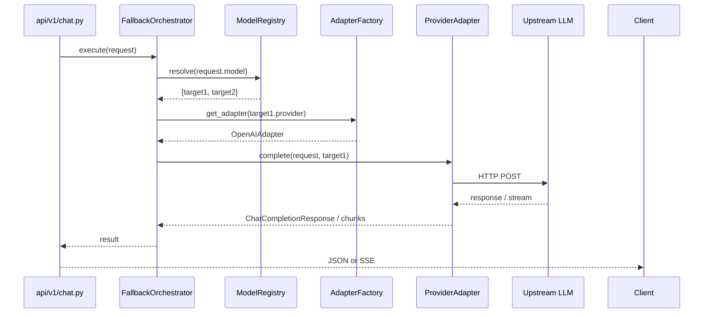

# Implementation Steps — Unified Model Router

Step-by-step build order for the Python model router gateway.  
Full architecture, scope, and trade-offs: [`../scope.md`](../scope.md).

**Principle:** Build **inside-out** — foundation → adapters → orchestration → HTTP edge.

> **Review resolutions (canonical):**
> - Upstream **401/403** and missing API keys → **retryable** (fallback to next provider)
> - Client **400** and unknown model → **fatal** (no fallback)
> - **`models.yaml`** uses explicit `{ provider, model }` objects; include `groq` in `providers:`
> - **Routing MVP:** alias-only (`smart/general`); unknown model → 400
> - **API keys:** `ProviderConfig.api_key_env` → `os.environ` via `get_provider_api_key()` helper
> - **HTTP client:** shared `httpx.AsyncClient` created in FastAPI lifespan (`app.state.http`)
> - **Adapter API:** split `complete()` / `stream()` (not single `chat_completion()`)

---

## Design patterns map

| Pattern | Where | Purpose |
|---|---|---|
| **Adapter** | `providers/*.py` | Normalize each LLM API to one gateway contract |
| **Factory** | `providers/__init__.py` | Create the right adapter by provider name |
| **Protocol** | `providers/base.py` | Adapter contract without rigid inheritance |
| **Registry / Repository** | `router/registry.py` | Load and resolve routing config (`models.yaml`) |
| **Chain of Responsibility** | `orchestrator/fallback.py` | Try providers in order until one succeeds |
| **Facade** | `orchestrator/fallback.py` | Single entry point hiding adapter + stream complexity |
| **Strategy** | adapter selection via factory | Swap provider behavior without changing orchestrator |
| **App Factory** | `main.py` → `create_app()` | Compose middleware, DI, routes in one place |
| **Dependency Injection** | FastAPI `Depends()` | Inject settings, registry, orchestrator into handlers |
| **Middleware** | `middleware/*` | Cross-cutting auth and request tracing |

### Layer dependency rule

```text
HTTP (api/)  →  Orchestrator  →  Adapters  →  Upstream APIs
                    ↓
              Registry + Health
                    ↓
              Schemas + Errors + Settings
```

**Never import upward:** adapters must not import from `api/` or `orchestrator/`.

---

## Implementation checklist

```text
[x] Phase 0  — Bootstrap (dirs, venv, .env)
[x] Phase 1  — settings.py, errors.py, schemas.py, main.py skeleton
[ ] Phase 2  — middleware (DEFERRED — auth not implemented; implement when needed)
[x] Phase 3  — config/models.yaml, router/registry.py
[x] Phase 4  — providers/base.py, openai_adapter.py, __init__.py factory
[x] Phase 5  — streaming/proxy.py
[x] Phase 6  — orchestrator/fallback.py
[x] Phase 7  — api/v1/chat.py (wire orchestrator)
[x] Phase 8  — router/health.py + orchestrator integration
[x] Phase 9  — logging, headers, README
[ ] Phase 10 — tests (optional)
[ ] Phase 4b — anthropic_adapter.py (after core path works)
```

### Critical path (if time is tight)

```text
1 → 3 → 4.1 → 4.2 → 4.4 → 5 → 6 → 7 → 2 (auth/middleware last)
```

Skip: Anthropic adapter (4.3), health (8), models endpoint (7.2), tests (10). Phase 2 deferred until after Phase 7.

---

## Interface contracts (define before bodies)

```python
# providers/base.py
class ProviderAdapter(Protocol):
    async def complete(self, request, target) -> ChatCompletionResponse: ...
    async def stream(self, request, target) -> AsyncIterator[ChatCompletionChunk]: ...

# router/registry.py
class ModelRegistry(Protocol):
    def resolve(self, logical_model: str) -> list[RouteTarget]: ...
    def get_provider(self, name: str) -> ProviderConfig: ...

# orchestrator/fallback.py
class InferenceOrchestrator(Protocol):
    async def execute(self, request, request_id: str) -> ChatCompletionResponse: ...
    async def execute_stream(self, request, request_id: str) -> AsyncIterator[ChatCompletionChunk]: ...
```

---

## Phase 0 — Bootstrap (5 min)

**Status:** complete (deps installed, scaffold created, `.env` copied)

**Modules:** project dirs, empty `__init__.py` files, `.env`

**Tasks:**
1. Create directory tree (see `scope.md` §9)
2. Confirm `.venv` + `requirements.txt` installed
3. Copy `.env.example` → `.env`
4. Scaffold empty modules:

```bash
mkdir -p app/{middleware,router,orchestrator,providers,streaming,api/v1} config tests
touch app/__init__.py app/{main,settings,errors,schemas}.py
touch app/middleware/{__init__,auth,request_id}.py
touch app/router/{__init__,registry,health}.py
touch app/orchestrator/{__init__,fallback}.py
touch app/providers/{__init__,base,openai_adapter,anthropic_adapter}.py
touch app/streaming/{__init__,proxy}.py
touch config/models.yaml
```

**Verify:**
```bash
source .venv/bin/activate && python -c "import fastapi, httpx, yaml; print('ok')"
```

---

## Phase 1 — Foundation layer (20 min)

Build shared primitives first. Everything else depends on these.

### Step 1.1 — `app/settings.py`

**Pattern:** Singleton config via `pydantic-settings`

```python
class Settings(BaseSettings):
    gateway_api_key: str
    models_config_path: Path = Path("config/models.yaml")
    connect_timeout_s: float = 3.0
    read_timeout_s: float = 120.0

    model_config = SettingsConfigDict(env_file=".env")

# app/providers/keys.py (or router/registry.py)
def get_provider_api_key(env_name: str) -> str | None:
    value = os.environ.get(env_name, "").strip()
    return value or None  # missing/empty → None → retryable skip
```

**Best practice:** Upstream provider keys live in env vars referenced by `models.yaml` (`api_key_env`). Only `gateway_api_key` is on `Settings`.

**Verify:** `Settings()` loads from `.env` without crash.

---

### Error classification reference (Phase 4.2 + 6.1)

| Condition | Exception | Fallback? |
|---|---|---|
| 400 bad client payload | `FatalError` | No |
| Unknown logical model | `UnknownModelError` | No |
| 401, 403 upstream auth | `RetryableError` | Yes |
| 429, 502, 503, 504 | `RetryableError` | Yes |
| Connect / read timeout | `RetryableError` | Yes |
| Missing/empty provider API key | `RetryableError` | Yes |
| Stream fails after first token | `FatalError` | No (emit error, stop) |

---

### Step 1.2 — `app/errors.py`

**Pattern:** Typed exception hierarchy + HTTP mapping

```python
class RouterError(Exception): ...
class RetryableError(RouterError): ...   # try next provider
class FatalError(RouterError): ...       # stop chain, return to client
class AllProvidersFailed(RouterError): ...
class UnknownModelError(FatalError): ...
```

Error JSON shape:
```json
{"error": {"message": "...", "type": "...", "code": "..."}}
```

**Verify:** `RetryableError` vs `FatalError` map to different HTTP status codes.

---

### Step 1.3 — `app/schemas.py`

**Pattern:** Anti-corruption layer (public contract isolated from provider shapes)

Define:
- `ChatMessage`, `ChatCompletionRequest`, `ChatCompletionResponse`
- `ChatCompletionChunk`, `StreamChoice`, `Delta`

**Verify:** Invalid body (missing `messages`) → `422`.

---

### Step 1.4 — `app/main.py` (skeleton)

**Pattern:** App Factory + httpx lifespan

```python
@asynccontextmanager
async def lifespan(app: FastAPI):
    settings = get_settings()
    app.state.http = httpx.AsyncClient(
        timeout=httpx.Timeout(
            connect=settings.connect_timeout_s,
            read=settings.read_timeout_s,
        )
    )
    yield
    await app.state.http.aclose()

def create_app() -> FastAPI:
    app = FastAPI(title="Model Router", lifespan=lifespan)
    app.get("/health")(lambda: {"status": "ok"})
    return app

app = create_app()
```

Pass `app.state.http` to adapters via factory: `get_adapter(provider, http_client, settings)`.

**Verify:**
```bash
uvicorn app.main:app --reload
curl localhost:8000/health
```

---

## Phase 2 — Cross-cutting concerns (15 min) — **DEFERRED**

> **On hold:** Gateway auth middleware is deferred. Request ID middleware is implemented in Phase 9.

Skip to **Phase 3** for now. Return to Phase 2 when gateway auth is needed.

## Phase 3 — Routing registry (15 min) — **COMPLETE**

### Step 3.1 — `config/models.yaml`

Canonical format (explicit `{ provider, model }`):

```yaml
routes:
  smart/general:
    primary: { provider: openai, model: gpt-4o-mini }
    fallbacks:
      - { provider: anthropic, model: claude-3-5-haiku-20241022 }
      - { provider: groq, model: llama-3.1-70b-versatile }

providers:
  openai:
    base_url: https://api.openai.com/v1
    api_key_env: OPENAI_API_KEY
  anthropic:
    base_url: https://api.anthropic.com
    api_key_env: ANTHROPIC_API_KEY
  groq:
    base_url: https://api.groq.com/openai/v1
    api_key_env: GROQ_API_KEY
```

**Routing MVP:** alias-only — `resolve("smart/general")` works; unknown model → `UnknownModelError`.

### Step 3.2 — `app/router/registry.py`

**Pattern:** Registry + Repository

```python
@dataclass(frozen=True)
class RouteTarget:
    provider: str
    model: str

@dataclass(frozen=True)
class ProviderConfig:
    base_url: str
    api_key_env: str

class ModelRegistry:
    def resolve(self, logical_model: str) -> list[RouteTarget]: ...
    def get_provider(self, name: str) -> ProviderConfig: ...
```

Load YAML once at startup (lifespan or `@lru_cache`).

**Verify:**
```python
assert len(registry.resolve("smart/general")) >= 1
```

---

## Phase 4 — Adapter layer (35 min) — **COMPLETE**

Build adapters before orchestrator. Test each in isolation.

### Step 4.1 — `app/providers/base.py`

**Pattern:** Adapter (Protocol)

```python
class ProviderAdapter(Protocol):
    provider_name: str

    async def complete(self, request, target) -> ChatCompletionResponse: ...
    async def stream(self, request, target) -> AsyncIterator[ChatCompletionChunk]: ...
```

Optional: `map_http_error(status_code: int) -> RouterError`

---

### Step 4.2 — `app/providers/openai_adapter.py`

**Pattern:** Adapter (pass-through for OpenAI-compatible APIs)

1. URL: `{base_url}/chat/completions`
2. Inject upstream model from `target.model`
3. Use shared `app.state.http` (`httpx.AsyncClient` from lifespan)
4. Resolve API key: `get_provider_api_key(provider_config.api_key_env)`; if None → raise `RetryableError`
5. Map HTTP status via `map_http_error()`:
   - `RetryableError`: 401, 403, 429, 502, 503, 504, timeouts
   - `FatalError`: 400 only

Works for **OpenAI** and **Groq** (different `base_url` in config).

**Verify:** Adapter call with real key → `ChatCompletionResponse`.

---

### Step 4.3 — `app/providers/anthropic_adapter.py` (optional / cut if late)

**Pattern:** Translation adapter

1. OpenAI messages → Anthropic `messages` + `system`
2. POST `/v1/messages`
3. Map response → `ChatCompletionResponse`
4. Map Anthropic SSE → OpenAI `ChatCompletionChunk`

---

### Step 4.4 — `app/providers/__init__.py`

**Pattern:** Factory

```python
def get_adapter(provider: str, http: httpx.AsyncClient, settings: Settings) -> ProviderAdapter:
    registry = {
        "openai": OpenAIAdapter,
        "anthropic": AnthropicAdapter,
        "groq": OpenAIAdapter,
    }
    ...
```

Factory is the **only** place importing concrete adapters.

**Verify:**
```python
assert get_adapter("openai", settings).provider_name == "openai"
```

---

## Phase 5 — Streaming module (20 min) — **COMPLETE**

### Step 5.1 — `app/streaming/proxy.py`

**Pattern:** Iterator / generator pipeline

```python
async def sse_stream(chunks: AsyncIterator[ChatCompletionChunk]) -> AsyncIterator[str]:
    async for chunk in chunks:
        yield f"data: {chunk.model_dump_json()}\n\n"
    yield "data: [DONE]\n\n"
```

Adapters yield typed chunks; proxy only formats SSE.

**Verify:** Stream yields `data:` lines ending with `[DONE]`.

---

## Phase 6 — Orchestrator (25 min) ★ — **COMPLETE**

### Step 6.1 — `app/orchestrator/fallback.py`

**Patterns:** Chain of Responsibility + Facade

```python
class FallbackOrchestrator:
    def __init__(self, registry: ModelRegistry, settings: Settings): ...

    async def execute(self, request, request_id: str) -> ChatCompletionResponse: ...
    async def execute_stream(self, request, request_id: str) -> AsyncIterator[ChatCompletionChunk]: ...
```

**Non-stream algorithm:**
```text
targets = registry.resolve(request.model)
for i, target in enumerate(targets):
    adapter = get_adapter(target.provider, http, settings)
    try:
        return await adapter.complete(request, target)
    except RetryableError:
        log attempt i+1; continue
    except FatalError:
        raise
raise AllProvidersFailed
```

**Stream algorithm:**
```text
first_token_sent = False
for target in targets:
    try:
        async for chunk in adapter.stream(request, target):
            first_token_sent = True
            yield chunk
        return
    except RetryableError:
        if first_token_sent: raise   # no mid-answer switch
        continue
```

**Verify:** Bad primary key → fallback succeeds; logs show attempt chain.

---

## Phase 7 — HTTP API layer (15 min) — **COMPLETE**

### Step 7.1 — `app/api/v1/chat.py`

**Pattern:** Thin controller + Dependency Injection

```python
@router.post("/v1/chat/completions")
async def chat_completions(
    body: ChatCompletionRequest,
    orchestrator: FallbackOrchestrator = Depends(get_orchestrator),
    request_id: str = Depends(get_request_id),
):
    if body.stream:
        chunks = orchestrator.execute_stream(body, request_id)
        return StreamingResponse(sse_stream(chunks), media_type="text/event-stream")
    return await orchestrator.execute(body, request_id)
```

Handler does **zero** routing logic — delegates to orchestrator.

**Verify:** E2E curl for stream + non-stream (see `scope.md` §14).

---

### Step 7.2 — `app/api/v1/models.py` (optional)

Return logical model IDs from `models.yaml`.

---

## Phase 8 — Resilience (10 min) — **COMPLETE**

### Step 8.1 — `app/router/health.py`

**Pattern:** Circuit breaker (in-memory)

```python
class ProviderHealth:
    def is_healthy(self, provider: str) -> bool: ...
    def record_failure(self, provider: str) -> None: ...
    def record_success(self, provider: str) -> None: ...
```

Orchestrator skips unhealthy providers before attempting.

**Verify:** After 3 forced failures, provider skipped on next request.

---

## Phase 9 — Observability + polish (10 min) — **COMPLETE**

1. Structured logs per attempt: `request_id`, `logical_model`, `target`, `attempt`, `latency_ms`, `outcome`
2. Response headers: `X-Request-Id`, `X-Routed-Provider`
3. `README.md` + `scripts/demo.sh`

---

## Phase 10 — Tests (10 min, optional)

| Test file | What | Pattern |
|---|---|---|
| `test_registry.py` | resolve order | Registry |
| `test_openai_adapter.py` | mock httpx with `respx` | Adapter |
| `test_fallback.py` | 503 → second provider called | Chain of Responsibility |
| `test_auth.py` | 401 without key | Middleware |

Test orchestrator with **mock adapters**, not real API keys.

---

## Data flow (one request)



---

## Key design rules

1. **Adapters** translate; **orchestrator** decides; **HTTP** delegates.
2. **Never import upward** — `providers/` must not import from `api/` or `orchestrator/`.
3. **Gateway schemas only** at the HTTP boundary.
4. **Factory is the only adapter registry.**
5. **Stream rule:** fallback before first token; fail gracefully after.
6. **Error rule:** upstream 401/403/missing key → fallback; client 400/unknown model → stop.
7. **Routing MVP:** alias-only from `models.yaml`; no `provider/model` passthrough yet.
8. **HTTP client:** one shared `httpx.AsyncClient` per app via lifespan.

---

## Suggested first coding session

Implement in this order:

1. `app/settings.py`
2. `app/errors.py`
3. `app/schemas.py`
4. `app/providers/base.py` (interfaces only)

Then adapters and orchestrator can proceed in parallel without rework.
